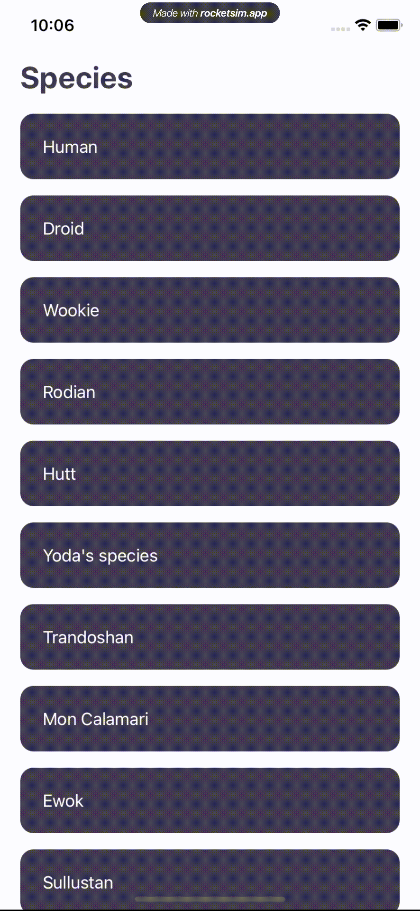

# WookiePedia

A simple app that fetches data from https://swapi.dev/



## Installation

Just run Yarn install

```bash
yarn install
```

## Usage

```bash
npx react-native run-ios
OR
npx react-native run-android
```

## License

[MIT](https://choosealicense.com/licenses/mit/)
